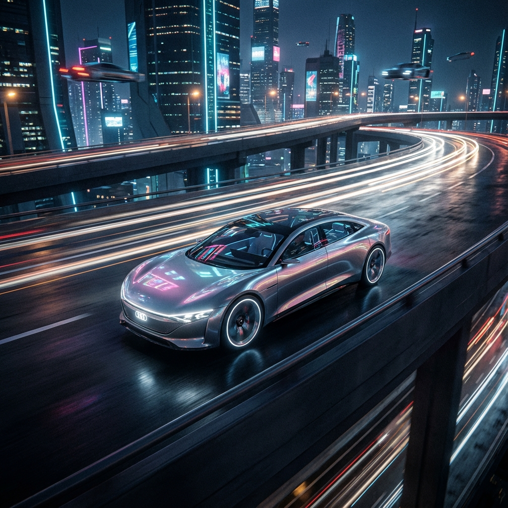

# Aether Automotive - The Future of Luxury Mobility



## Overview

Aether Automotive is a cutting-edge web application designed to showcase the next generation of electric luxury vehicles. This project demonstrates a premium, immersive digital experience that reflects the brand's commitment to innovation, sustainability, and performance.

The website features a modern, single-page application (SPA) architecture with smooth transitions, interactive 3D-like elements, and a high-end aesthetic powered by glassmorphism and advanced animations.

## Key Features

*   **Immersive Hero Section:** A visually stunning landing page with animated typography and a cinematic background.
*   **Dynamic Model Showcase:** Interactive grid displaying the vehicle lineup (Sedan, SUV, Sport, Electric) with filtering capabilities.
*   **Detailed Model Pages:** Dedicated pages for each vehicle featuring high-resolution imagery, technical specifications, and interior views.
*   **Innovation Hub:** A futuristic page highlighting the brand's core technologies (AI, Sustainability, Safety) with parallax scrolling and counting stats.
*   **Interactive Comparison Tool:** A side-by-side comparison feature allowing users to evaluate different models based on specs and price.
*   **Virtual Test Drive Booking:** A sleek, glassmorphism-styled form for scheduling test drives, set against a realistic showroom background.
*   **Corporate Identity:** Comprehensive "About Us" and "Careers" pages showcasing the company's vision, history, and opportunities.
*   **Legal Framework:** Fully implemented Privacy Policy, Terms of Service, and Cookie Settings pages.
*   **Responsive Design:** Fully optimized for all devices, ensuring a seamless experience on desktop, tablet, and mobile.

## Tech Stack

This project is built using a modern frontend stack to ensure performance, scalability, and developer experience:

*   **Framework:** [React](https://reactjs.org/) (v18)
*   **Build Tool:** [Vite](https://vitejs.dev/)
*   **Styling:** [Tailwind CSS](https://tailwindcss.com/)
*   **Animations:** [Framer Motion](https://www.framer.com/motion/)
*   **Routing:** [React Router](https://reactrouter.com/)
*   **Icons:** [Lucide React](https://lucide.dev/)

## Installation & Setup

Follow these steps to get the project running on your local machine:

1.  **Prerequisites:** Ensure you have Node.js (v16+) and npm installed.

2.  **Clone the Repository:**
    ```bash
    git clone <repository-url>
    cd car-website
    ```

3.  **Install Dependencies:**
    ```bash
    npm install
    ```

4.  **Run Development Server:**
    ```bash
    npm run dev
    ```
    The application will be available at `http://localhost:5173`.

5.  **Build for Production:**
    ```bash
    npm run build
    ```
    The output will be in the `dist` directory.

## Project Structure

```
src/
├── assets/          # Images and static assets
├── components/      # Reusable UI components (Navbar, Footer, Hero, etc.)
├── data/            # Static data files (cars.js)
├── pages/           # Page components (Home, Models, Innovation, etc.)
├── App.jsx          # Main application component with routing
├── main.jsx         # Entry point
└── index.css        # Global styles and Tailwind directives
```

## Design Philosophy

The design language of Aether Automotive revolves around **"Digital Luxury."** Key design elements include:

*   **Glassmorphism:** extensive use of translucent backgrounds with blur effects to create depth.
*   **Dark Mode Aesthetic:** A predominantly dark color palette with neon blue accents to evoke a futuristic feel.
*   **Motion:** Subtle, purposeful animations guide the user's attention and make the interface feel alive.
*   **Typography:** Clean, sans-serif typography (Outfit) for readability and modern appeal.

## License

This project is licensed under the MIT License.

---

&copy; 2025 Aether Automotive. All rights reserved.
